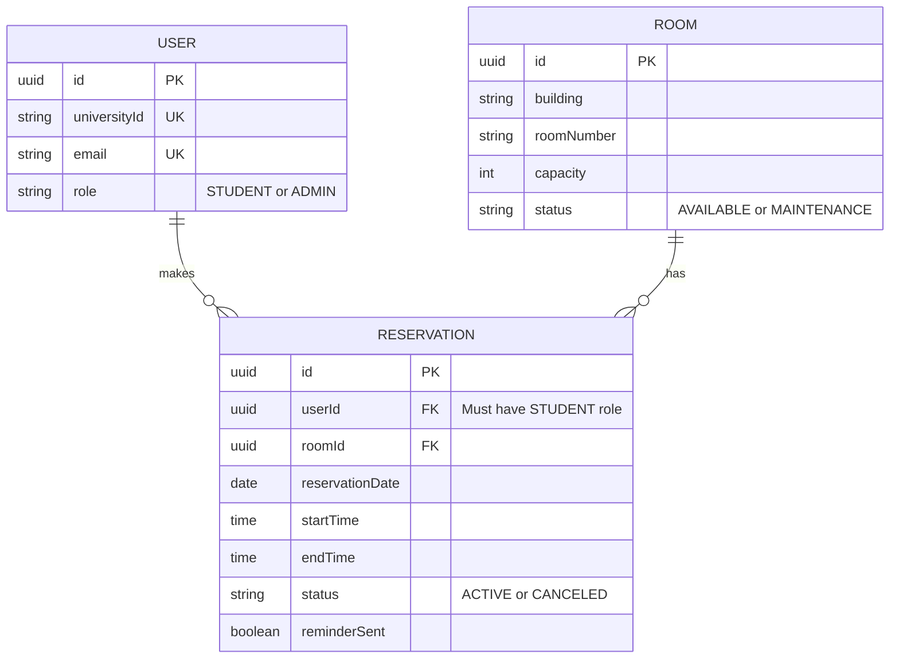

# AI Domain Model — First Draft

## Original AI Output

```mermaid
erDiagram
    USER ||--o{ RESERVATION : "makes"
    ROOM ||--o{ RESERVATION : "has"
    
    USER {
        uuid id PK
        string universityId UK
        string email UK
        string role "STUDENT or ADMIN"
    }

    ROOM {
        uuid id PK
        string building
        string roomNumber
        int capacity
        string status "AVAILABLE or MAINTENANCE"
    }

    RESERVATION {
        uuid id PK
        uuid userId FK "Must have STUDENT role"
        uuid roomId FK
        date reservationDate
        time startTime
        time endTime
        string status "ACTIVE or CANCELED"
        boolean reminderSent
    }
```