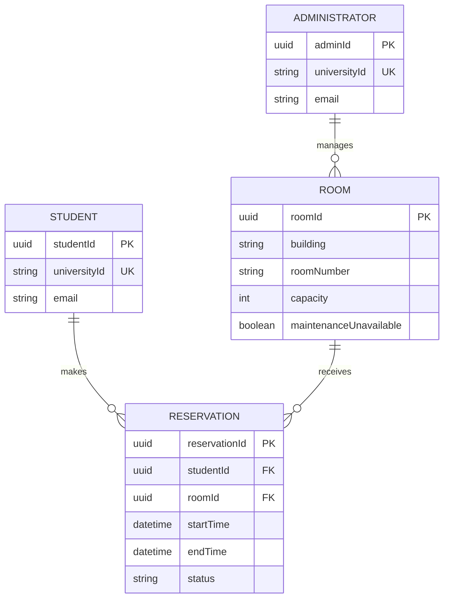

# Campus Study Room Reservation System
## Domain Model

## Model Rules

- A student can make zero or many reservations.
- Each reservation belongs to exactly one student.
- A room can have zero or many reservations over time.
- Each reservation is for exactly one room.
- An administrator can manage multiple rooms.
- Reservations for the same room cannot overlap.
- Back-to-back reservations are allowed.
- A reservation cannot exceed two hours.
- Canceled reservations remain stored with a canceled status.
- Rooms marked unavailable for maintenance cannot be reserved.